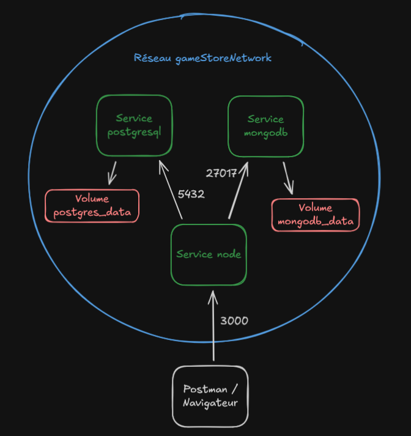

# Projet gameStore 

Ce projet a pour but de créer une API Game Store pour gérer les jeux, les utilisateurs et leurs profils, les catégories et les commentaires des utilisateurs. Cette API doit être sécurisée, documentée et doit utiliser un modèle MVC avec de la POO.

## Technologies utilisées

- Node.js
- PostgreSQL
- MongoDB
- Postman, Jest et Supertest
- Swagger

### Dépendances utilisées

- express
- dotenv
- pg
- mongoose
- cors
- jsonwebtoken
- bcrypt
- express-rate-limit
- jest
- supertest
- swagger-ui-express
- swagger-jsdoc

## Installation

### Prérequis:

- Docker (version 26.0 minimum)
- Docker compose (version 2.0 minimum)
- OS (Linux, macOS ou Windows avec Docker Desktop)

Vérifier les versions :

- `docker --version`
- `docker compose version`

Cloner le repo: 
- `git clone https://github.com/nathanremond/gameStore`

Configurer le .env:
- `cd gameStore`
- `cp .env.example .env`

Démarrer les conteneurs Docker:
- `docker compose up -d`

Arrêter les conteneurs Docker:
- `docker compose down`

## Configuration

.env: Fichier contenant les variables d'environnements des bases de developpement.

.env.test: Fichier contenant les variables d'environnements des bases de test.

#### Variables d'environnements de .env et .env.test:

NODE_ENV=test (uniquement pour le fichier .env.test)

PGUSER= nom de l'utilisateur postgreSQL

PGHOST= postgresql_compose

PGDATABASE= nom de la DB de dev ou de test

PGPASSWORD= mot de passe de l'utilisateur postgreSQL

PGPORT=5432

MONGO_USER= nom de l'utilisateur MongoDB

MONGO_PASSWORD= mot de passe de l'utilisateur MongoDB

MONGO_URI= mongodb://mongodb_compose:27017/nom de la DB de dev ou de test

MONGO_DBNAME= nom de la DB de dev ou de test

JWT_SECRET= Token secret (au choix)

PORT=3000

## Description des services

#### node:

- Dockerfile: Dockerfile.node
- Ports exposés: 3000
- Variables d'environnement: PORT, MONGO_URI, POSTGRES_HOST, POSTGRES_DB

#### postgresql:

- Dockerfile: Dockerfile.postgresql
- Ports exposés: 5432
- Variables d'environnement: POSTGRES_USER, POSTGRES_PASSWORD, POSTGRES_DB

#### mongodb:

- Dockerfile: Dockerfile.mongodb
- Ports exposés: 27017
- Variables d'environnement: MONGO_INITDB_ROOT_USERNAME, MONGO_INITDB_ROOT_PASSWORD, MONGO_INITDB_DATABASE

### Réseaux

Tous les services sont connectés au réseau user-defined gameStoreNetwork.
Cela permet aux services Node de contacter MongoDB et PostgreSQL via leurs noms de service.

### Volumes

Les volumes postgres_data et mongodb_data permettent d'avoir une persistance des données même si les conteneurs sont supprimés.

### Schéma d'architecture

## Documentation de l'API

#### Routes principales

- /api/auth
- /api/users
- /api/games
- /api/comments
- /api/categories
- /api/profiles

Chaque CRUD contient:

- GET / => 200
- GET /:id => 200
- POST / => 201
- PUT /:id => 200
- DELETE /:id => 204

à l'exception de /api/auth:

- POST /register => 201
- POST /login => 200

Documentation Swagger disponible:

- `http://localhost:3000/docs`

## Tests

Les tests s'appliquent aux bases de tests seulement si les fichiers .env et .env.test sont correctement remplis.

Lancer les tests jest / supertest:

- `npm run test`

Une collection postman se trouve dans le dossier exports.

## Sécurité

- Middleware Auth: Gère la connexion d'un utilisateur.
- Middleware Errors: Permet une gestion d'erreurs centralisée ainsi que des erreurs plus compréhensible. Permet de ne pas montrer les erreurs aux utilisateurs.
- Middleware Roles: Vérifie si un utilisateur possède un certain requis pour certaines routes.
- Hashage des mots de passes des utilisateurs lors de leur création.
- Ajout de CORS pour que les requêtes fonctionnent.
- Ajout d'un rate limiter pour éviter une surcharge de requêtes (désactivé pour les tests)